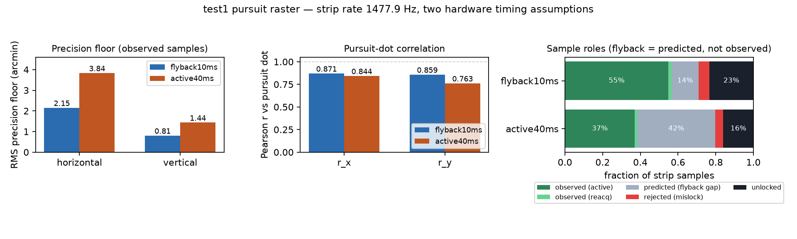

# sdslo-gaze

High-rate (**~1.5 kHz**) 2-D gaze from SD-SLO video via strip image registration, with the scanner **flyback gap** treated as missing data (not measured motion).

Companion research codebase (multimodal particle filter at line rate): [`gaze-model`](https://github.com/strangecradles/gaze-model).

## Results (`test1` pursuit raster)

Timing models are hardware assumptions (active/flyback split is not measurable from the encoded video). Numbers from committed manifests in `results/`.

| Timing model | Strip rate | Prec. floor H / V | Microsaccades | Pursuit-dot r_x / r_y |
|---|---:|---:|---:|---:|
| `flyback10ms` | 1477.9 Hz | 2.154′ / 0.808′ | 494 (main-seq r=0.864) | 0.871 / 0.859 |
| `active40ms` | 1477.9 Hz | 3.837′ / 1.438′ | 262 (main-seq r=0.807) | 0.844 / 0.763 |



*Same manifests, visually: precision floor and pursuit-dot correlation per timing model, plus the fraction of strip samples that are actually observed vs predicted across the flyback gap. Regenerate with `python scripts/plot_results.py`.*

- Accuracy reported on **observed** samples only; flyback samples are predict-only.
- Blind-gap microsaccade waveforms are **not** claimed recovered.
- Absolute waveform fidelity vs artificial eye: future work. Not a medical device.

## What it does

1. Strip-tracks frames with 2-D NCC (Sheehy/Roorda strip idea; incremental previous-frame reference).
2. Labels every sample with a measurement state (`observed_active`, `predicted_flyback`, …).
3. Detects microsaccades on observed segments; reports duty cycle into the blind gap.

## Install / quickstart

```bash
pip install -e ".[dev]"
export SDSLO_DATA_ROOT=/path/to/gaze-model   # videos + caches not vendored
sdslo-gaze validate --which test1 --timing flyback10ms
```

## Layout

`src/sdslo_gaze/` — `strip_tracker`, `scan_timing`, `gap_model`, `microsaccade`, `metrics`, `pipeline`, `cli`  
`docs/flyback.md` — physics of the dead-time  
`tests/` — unit coverage of timing, tracker, metrics

## License

MIT
